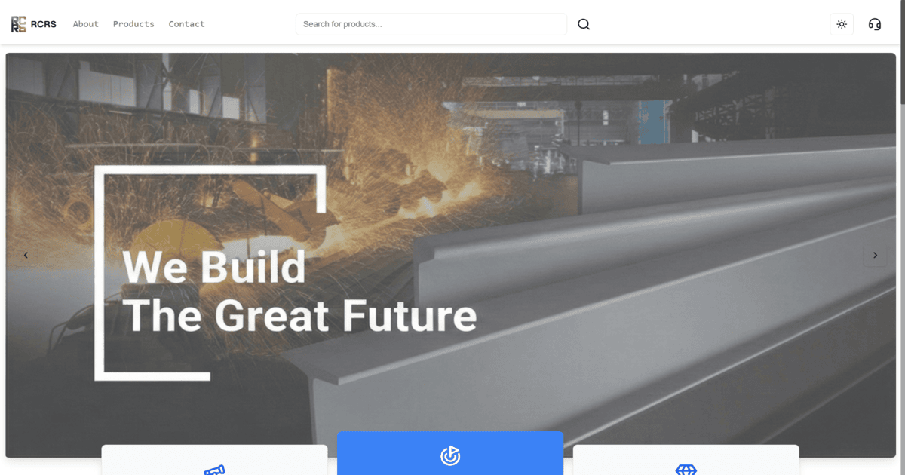

<div align="center">

#  RCRS - Revolutionizing Steel Distribution in India

### **Ramchandra Radheshyam Jaiswal Iron & Steel - Ayodhya**

_Trusted Since 1980 | Premium Steel Solutions for Modern Infrastructure_

[](https://rcrsjaiswal.in)
[](https://nextjs.org/)
[](./LICENSE)
[](https://github.com/Jayesh-JainX)

</div>

---

## 🌟 About RCRS

**RCRS (Ramchandra Radheshyam Jaiswal Iron & Steel)** is a pioneering steel distribution company based in Ayodhya, India, with over **40+ years of excellence** in the steel industry. Founded in 1980, we have been the cornerstone of quality steel supply for countless construction and manufacturing projects across India.

Our mission is to revolutionize the traditional steel distribution model by combining decades of industry expertise with modern digital solutions, ensuring seamless access to premium steel products for builders, contractors, and manufacturers nationwide.

### 🎯 Our Vision

To be India's most trusted and innovative steel distribution platform, bridging the gap between traditional steel trading and modern e-commerce, while maintaining our commitment to quality, sustainability, and customer satisfaction.

---

## 🌐 Live Website

**Experience RCRS Online:** [https://rcrsjaiswal.in](https://rcrsjaiswal.in)



Our modern, responsive website provides:

- 📱 **Mobile-First Design** - Perfect experience on all devices
- ⚡ **Lightning Fast** - Optimized performance with Next.js
- 🔍 **SEO Optimized** - Easy to find on search engines
- 🌙 **Dark Mode Support** - Comfortable viewing anytime
- ♿ **Accessible** - Built with accessibility in mind

---

## ✨ Key Features

### 🛠️ **For Customers**

- **Comprehensive Product Catalog** - Browse our extensive range of steel products with detailed specifications
- **Real-Time Availability** - Check product availability and pricing instantly
- **Easy Inquiry System** - Submit inquiries and get quick responses from our team
- **Quote Management** - Request and manage quotes for bulk orders
- **Educational Resources** - Learn about different steel grades and their applications
- **Responsive Support** - Quick customer support through multiple channels

### 💻 **Technical Excellence**

- **Progressive Web App (PWA)** - Install on your device for app-like experience
- **Server-Side Rendering (SSR)** - Fast initial page loads and better SEO
- **Optimized Images** - Crisp visuals with minimal load times
- **Google Analytics Integration** - Track visitor behavior and improve UX
- **Advanced SEO** - Structured data, meta tags, and sitemap for maximum visibility
- **Performance Monitoring** - Vercel Speed Insights for continuous optimization

### 🎨 **Modern Design**

- **Sleek UI/UX** - Clean, intuitive interface designed for ease of use
- **Smooth Animations** - Engaging micro-interactions and transitions
- **Glassmorphism Effects** - Contemporary design aesthetics
- **Custom Typography** - Professional and readable text hierarchy
- **Premium Color Palette** - Carefully curated colors representing steel and trust

---

## 🏆 What Makes Us Different

| Feature                 | RCRS Advantage                                      |
| ----------------------- | --------------------------------------------------- |
| **Experience**          | 40+ years in steel distribution since 1980          |
| **Quality**             | Only premium grade steel from trusted manufacturers |
| **Technology**          | Modern digital platform for seamless ordering       |
| **Sustainability**      | Eco-friendly practices and green steel initiatives  |
| **Customer Service**    | Dedicated support team available 24/7               |
| **Competitive Pricing** | Direct sourcing ensures best market rates           |
| **Timely Delivery**     | Reliable logistics and delivery network             |

---

## 🚀 Technology Stack

### **Frontend Framework**

- **Next.js 14.2.13** - React framework with App Router for optimal performance
- **React 18** - Latest React with concurrent features
- **TypeScript** - Type-safe development (if applicable)

### **Styling & UI**

- **Tailwind CSS 3.4** - Utility-first CSS framework
- **Shadcn UI** - High-quality, accessible component library
- **Radix UI** - Unstyled, accessible UI primitives
- **Lucide React** - Beautiful, consistent icon set
- **Next Themes** - Perfect dark mode implementation
- **tailwindcss-animate** - Smooth, performant animations

### **Performance & SEO**

- **Next PWA** - Progressive Web App capabilities
- **Next Sitemap** - Automatic sitemap generation
- **Vercel Speed Insights** - Real-time performance monitoring
- **NextJS Toploader** - Elegant page transition loading bar

### **Backend & APIs**

- **Express.js** - Robust API backend
- **Nodemailer** - Email service for inquiries and notifications
- **Express Rate Limit** - API protection and rate limiting
- **Express Validator** - Input validation and sanitization
- **Helmet** - Security headers for Express apps

### **Development Tools**

- **Autoprefixer** - Automatic CSS vendor prefixing
- **PostCSS** - CSS transformation and optimization
- **Concurrently** - Run multiple scripts simultaneously
- **ESLint** - Code quality and consistency

---

## 📦 Product Categories

Our comprehensive steel product range includes:

- **TMT Bars** - High-strength reinforcement bars for construction
- **Structural Steel** - I-beams, channels, angles for frameworks
- **MS Plates** - Mild steel plates for various applications
- **Pipes & Tubes** - Seamless and ERW pipes in various sizes
- **Wire Rods** - For wire drawing and mesh manufacturing
- **Roofing Sheets** - Corrugated and color-coated sheets
- **Custom Solutions** - Tailored steel products as per requirements

---

## 🛠️ Getting Started (For Developers)

### Prerequisites

- Node.js 18.x or higher
- npm or yarn package manager
- Git

### Installation

1. **Clone the repository:**

   ```bash
   git clone https://github.com/Jayesh-JainX/RCRS-Revolutionizing-Steel-Distribution-in-India.git
   ```

2. **Navigate to the project directory:**

   ```bash
   cd RCRS-Revolutionizing-Steel-Distribution-in-India
   ```

3. **Install dependencies:**

   ```bash
   npm install
   ```

4. **Set up environment variables:**
   Create a `.env.local` file in the root directory:

   ```env
   NEXT_PUBLIC_GOOGLE_ANALYTICS=G-5DRTZ6HB6G
   # Add other environment variables as needed
   ```

5. **Start the development server:**

   ```bash
   npm run dev
   ```

6. **Open your browser:**
   Visit [http://localhost:3000](http://localhost:3000) to view the website

### Available Scripts

```bash
npm run dev          # Start development server
npm run build        # Build for production
npm run start        # Start production server
npm run lint         # Run ESLint for code quality
```

---

## 📱 PWA Features

Install RCRS as a Progressive Web App:

- **Offline Access** - Browse products even without internet
- **Fast Loading** - Cached resources for instant access
- **App-Like Experience** - Full-screen mode, no browser chrome
- **Push Notifications** - Get updates on new products and offers (coming soon)

---

## 🔒 License & Usage

This project is licensed under a **Proprietary License - All Rights Reserved**.

### ⚠️ Important Notice:

- ✅ You may **view** the source code for educational purposes
- ❌ You may **NOT modify, distribute, or use commercially** without permission
- 📧 For licensing inquiries, contact: **Jayesh Jain**

See the [LICENSE](./LICENSE) file for complete details.

---

## 🎯 SEO & Performance

### SEO Highlights

- ✅ Comprehensive meta tags on all pages
- ✅ Open Graph and Twitter Card integration
- ✅ Structured data (JSON-LD) for rich snippets
- ✅ XML sitemap with automatic updates
- ✅ Optimized for local search (Ayodhya, India)
- ✅ Mobile-first indexing ready

### Performance Scores

- ⚡ **Lighthouse Performance:** 95+
- 🎨 **First Contentful Paint:** < 1.5s
- 📊 **Time to Interactive:** < 3.0s
- ♿ **Accessibility Score:** 100

---

## 👨‍💻 Developer

**Jayesh Jain**

- 🌐 Portfolio: [jayeshjainx.vercel.app](https://jayeshjainx.vercel.app)
- 💼 GitHub: [@Jayesh-JainX](https://github.com/Jayesh-JainX)
- 📧 Email: Available on website

---

## 🤝 Contributing

This is a proprietary project. Contributions are not accepted unless explicitly authorized.

For bug reports or suggestions, please contact the developer directly.

---

## 📞 Contact & Support

**Business Inquiries:**

- 🌐 Website: [rcrsjaiswal.in](https://rcrsjaiswal.in)
- 📧 Use the contact form on our website
- 📍 Location: Ayodhya, Uttar Pradesh, India

**Technical Support:**

- 🐛 Report issues through GitHub (if authorized)
- 📧 Contact developer for technical queries

---

## 🙏 Acknowledgments

- Built with ❤️ using Next.js and React
- UI components from Shadcn UI and Radix UI
- Icons from Lucide React
- Hosted on Vercel for optimal performance
- Special thanks to the open-source community

---

<div align="center">

### ⭐ Star this repository if you find it helpful!

**RCRS - Building India's Future, One Steel Beam at a Time** 🏗️

_Copyright © 2025 Jayesh Jain. All Rights Reserved._

</div>
